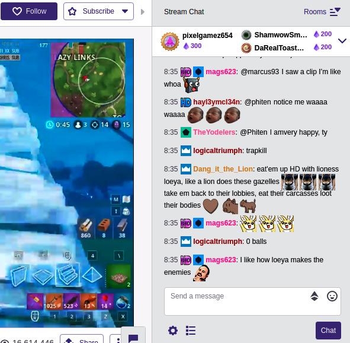
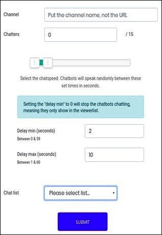

# SHERLOCK : A Scalable, Hybrid Bot Detection Framework for Livestreaming Chatlogs

  
  

## Objective
The purpose of our project is to detect chatbots in chatrooms of livestreaming services. Most livestreaming platforms recommed stream(er)s to viewers based on engagement of streams (viewership and chatroom activity). Popular streams consistently attracting a large number of users to their streams have various ways to monetize their content and make a lot of money. To fast-track gain in popularity, some streamers use fraudulent methods such as inflating viewership (through viewbots) and increasing chatroom activity (through chatbots). We aim to detect streams which are chatbotted and the constituent fake chatbot handles.

## Problem
We formulate the problem into two subproblems. First is to detect whether the stream is chat botted in real time. Secondly if it is then find out the chat bots in that corrupted stream. 

## Solution
* For Stage 1, we have used supervised approach to predict whether the given stream is chatbotted or not.
* For Stage 2, we took the help of semi supervised approach `Label Propagation` due to less number of labelled users.

## Simulation
* To detect whether the given stream is botted, execute the following command:
`python StreamClassification.py`
* To determine the constituent bot users in corrupted stream, run the following command:
`python modified_main.py <Merged Users filename> <Real Users filename>`
Here` Merged Users filename` is a corrupted file with both real and bot users while `Real Users filename` consists of corresponding legitimate real users.

## Note
* Use `python>=2.7.13`
* Write to us for any implementation clarity or dataset request at shreya.jain@research.iiit.ac.in or dipankar.niranjan@research.iiit.ac.in.
