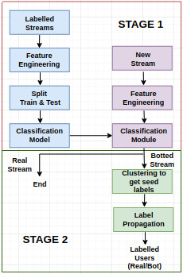
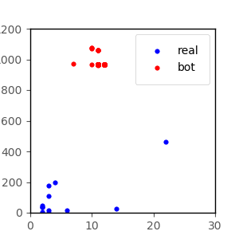
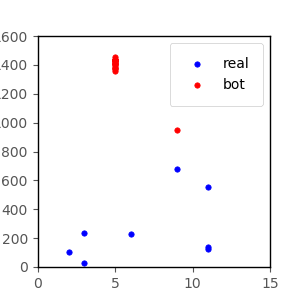
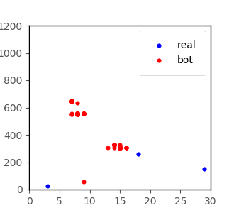
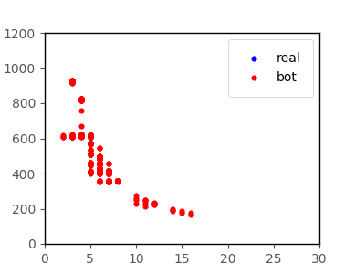

# SHERLOCK : A Scalable, Hybrid Bot Detection Framework for Livestreaming Chatlogs

  
  
  

## Objective
The purpose of our project is to detect chatbots in chatrooms of livestreaming services. Most livestreaming platforms recommed stream(er)s to viewers based on engagement of streams (viewership and chatroom activity). Popular streams consistently attracting a large number of users to their streams have various ways to monetize their content and make a lot of money. To fast-track gain in popularity, some streamers use fraudulent methods such as inflating viewership (through viewbots) and increasing chatroom activity (through chatbots). We aim to detect streams which are chatbotted and the constituent fake chatbot handles.

## Problem
We formulate the problem in terms of two subproblems. In the first stage, we detect whether the stream is chatbotted or not. If a stream is flagged as chatbotted, we move on to the second stage and detect the constituent fake chatbot handles of the flagged stream.

## Solution
* For Stage 1, we have used a **supervised approach** to predict whether the given stream is chatbotted or not. The training set consists of a combination of synthetically generated chatbotted streams and real streams (streams with no inflated activity) The classification module (a SVM classifier), trained using this approach, can then be used to detect if a given (real world) stream shows signs of inflated activity (or not).
* For Stage 2, we utilize a **semi-supervised approach - Label Propagation** - we have an initial set of seed labels for a flagged stream (obtained using **XMeans clustering**), which we utilize, together with information from various modalities, to propagate and assign labels to the unknown datapoints. Each user in a flagged stream from stage 1 is assigned a label - real/bot. A supervised approach is not advisable for stage 2 due to (i) infeasibility of having a labelled dataset, (ii) problems with regard to generalizability when supervised methods are used.
* By splitting the complex overall problem of detecting chatbots into two stages, we get the following benefits: (i) we can utilize a supervised approach for stage 1, as features exhibiting consistent patterns are much easier to find at the stream level, (ii) in terms of interpretability, we can make a set of assumptions about the data for stage 2 - if a stream is flagged as chatbotted, then with a high probability, we expect to find both real and bot user handles, which helps with setting clustering thresholds and looking at particular regions of the graph, (iii) in terms of scalability, we perform the more computationally intensive stage 2 only on streams flagged as chatbotted.  

## Code
* The `Data Collection` directory contains `scrape.js` which scrapes the data from a list of Twitch streams provided as input. Requires **tmi.js** <https://github.com/tmijs/tmi.js> Returns chatlogs in the form of *.txt* files of the respective streams where each line is a JSON string containing: {"t": timestamp, "u": username, "e": emoteset, "m": messsage with special characters intact, "nm": message with special characters removed} To anonymize this, use `anonymizer.py`. This also adds labels (real/bot) to the above JSON string if they are available for the given chatlog.
* Two sample anonymized files have been provided in `Sample Data`
* `Code` contains the code for **Stage 1**, **Stage 2**, and the **Baseline**. Please refer to the `readme.md` therein for instructions on how to execute them.
* `Misc` contains miscellaneous code for - text based features (which were not used), other clustering methods, conversational graphs, creating a synthetic dataset by merging files, etc.

  
  
  
  

## Notes
* Use `python>=2.7.13` and perform a `pip install -r requirements.txt` before starting out.
* Please write to us for access to the complete dataset (or for implementation related queries) at shreya.jain@research.iiit.ac.in or dipankar.niranjan@research.iiit.ac.in.
